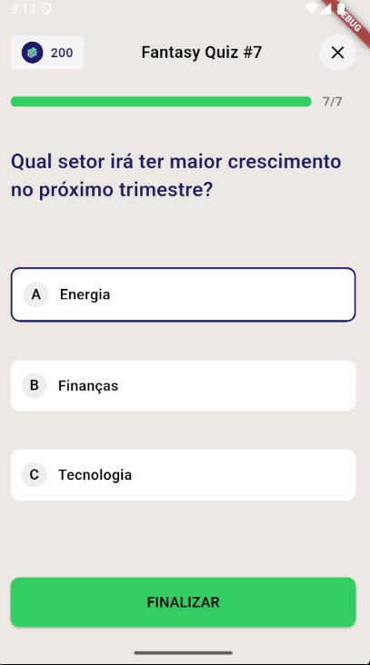
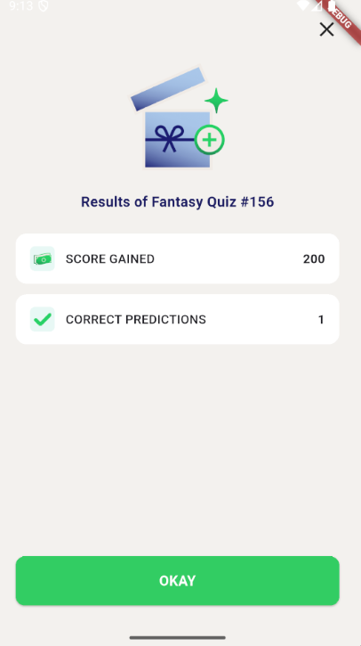

# 📊 Fantasy Quiz App

Um aplicativo Flutter de quiz interativo, como ações, índices. O usuário responde perguntas de múltipla escolha em uma interface moderna e intuitiva.

---

## ✨ Funcionalidades

- Exibição de perguntas com progresso visual
- Tokens como sistema de pontuação
- Navegação por perguntas
- Página de resultado com pontuação final
- Interface responsiva e amigável

---

## 📱 Tela Principal

- Mostra uma pergunta com três opções (A, B, C)
- Barra de progresso indicando o andamento
- Sistema de seleção de opção (com destaque visual)
- Botão **Continue** ou **Finalizar** dependendo da etapa

---

## 🧱 Estrutura do Projeto

- `models/question_model.dart` → Modelos de dados para perguntas e opções
- `widgets/option_tile.dart` → Componente customizado para as opções
- `widgets/question_widget.dart` → Componente para exibição da pergunta
- `widgets/token_badge.dart` → Exibe os tokens ganhos
- `screens/quiz_result_page.dart` → Tela de resultado final
- `screens/quiz_page.dart` → Tela principal do quiz
- `core/utils/colors.dart` → Paleta de cores customizadas
- `core/utils/text_styles.dart` → Estilos de texto reutilizáveis

---

## 🚀 Como executar

1. Clone o repositório:
   ```bash
   git clone https://github.com/RafaellaBarbosa/quiz_app.git

2. Instale as dependências:
   ```bash
   flutter pub get
   ```

3. Execute o app:
   ```bash
   flutter run
   ```

---

## 🖼️ Preview

### 🏠 Tela inicial


### ✅ Tela de resultado


---

## 📌 Observações

- O app atualmente usa dados estáticos.
- Pode ser facilmente adaptado para consumir uma API REST.

---

## 🧑‍💻 Autor

Desenvolvido por **Rafaella Barbosa Costa**  
[LinkedIn](https://www.linkedin.com/in/rafaella-costa/) 
---

